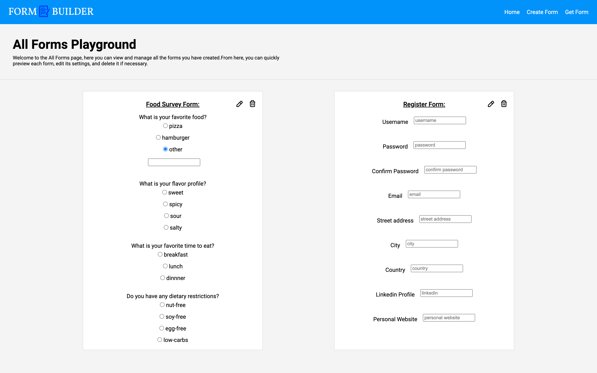
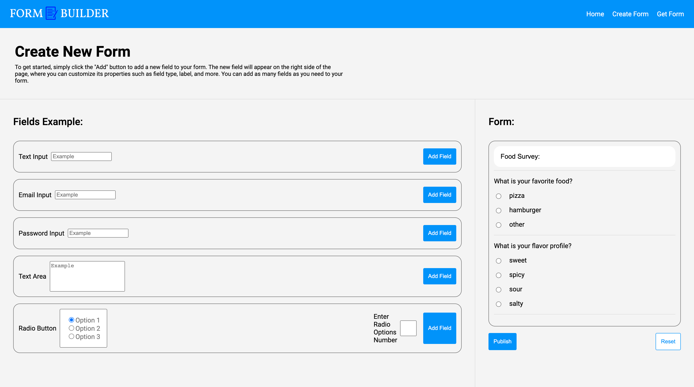

# Stock App

This app allow you to create and build forms with different types and save them, in addition you can edit existing forms or delete them if you'd like

## Live Demo

will update link

## Screenshot

## Installation and Usage

1. Clone the repository to your local machine using the command
   `git clone https://github.com/liordesta/form-builder.git`.
2. Navigate to the project directory using `cd form-builder`.
3. Install frontend dependencies using `cd frontend && npm install or yarn install`.
4. Install backend dependencies using `cd backend && npm install or yarn install`.
5. Create a new Mongo cluster and a new collection named `forms`.
6. Create a local `.env` file on the backend root and add `MONGODB_URI`.
7. Start the development on both `frontend` & `backend` using `npm start or yarn start`.

## Technologies

List of technologies/tools used in the project:

- ReactJS
- NodeJS
- Express
- MongoDB
